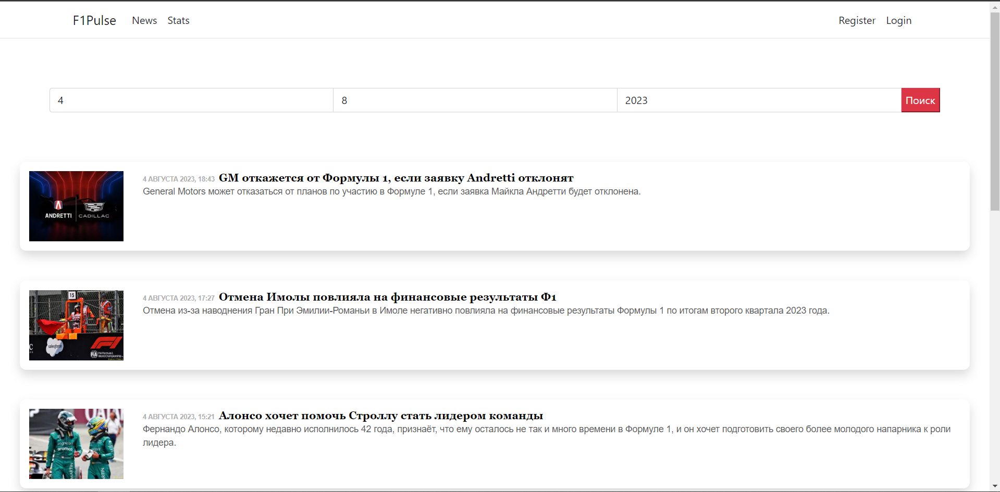
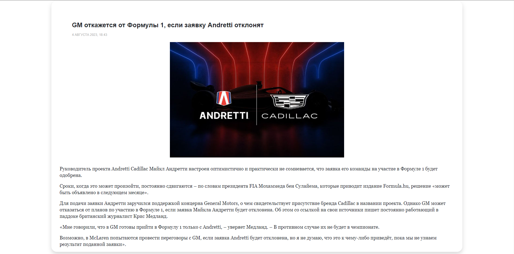
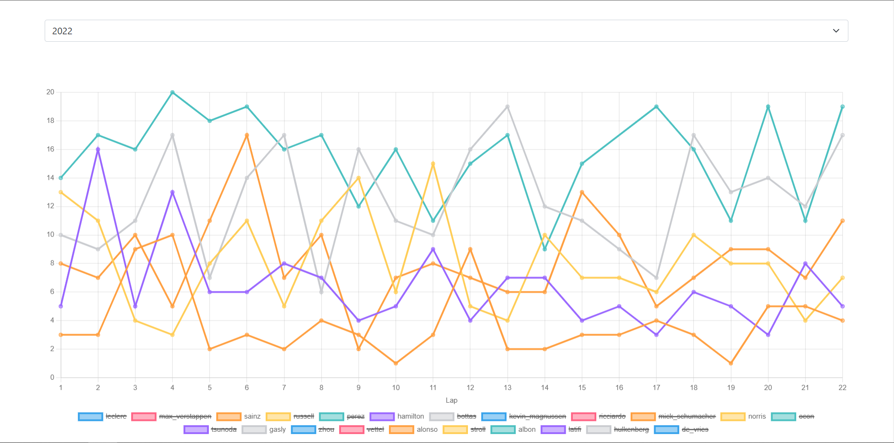
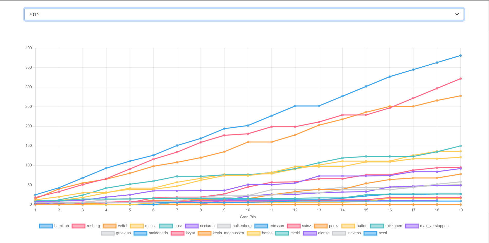
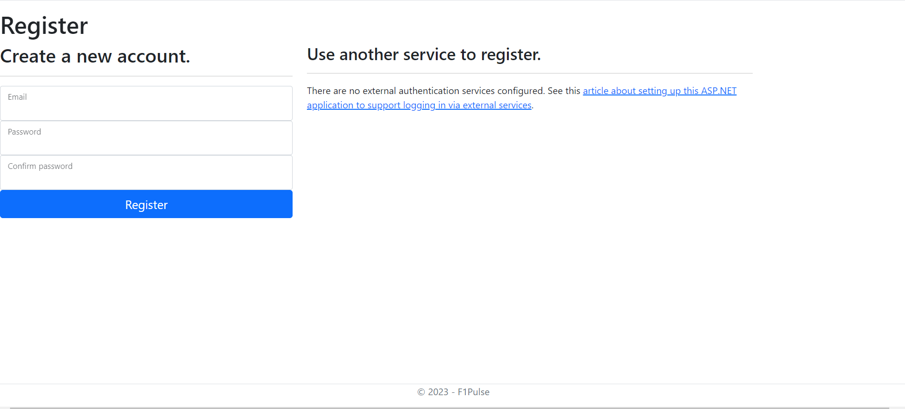

  

# F1Pulse
F1Pulse is a web application for Formula 1 fans that allows user to read news and comment on them, as well as follow races and championship statistics. 

## Used technologies and data sources

- News are parsed from thematic website [f1news.ru](https://www.f1news.ru/)

- Visualized data is taken from [Ergast Developer Api](http://ergast.com/mrd/), an experimental service which provides a historical record of motor racing data for non-commercial purposes.

- The Application itself is developed using **ASP.NET Core** and **.NET 6**

- For news parsing [Html Agility Pack](https://html-agility-pack.net/) is used. It is a .NET code library that allows you to parse "out of the web" HTML files.

- For users' authentification [ASP.NET Core Identity](https://github.com/dotnet/aspnetcore/tree/main/src/Identity) is used. ASP.NET Core Identity is the membership system for building ASP.NET Core web applications, including membership, login, and user data.

- For database managing [Entity Framework Core](https://github.com/dotnet/efcore) is used. EF Core is a modern object-database mapper for .NET.

## Overview

Entered the main page, the user can see a list of news for a specific date (today's by default).

The user is able to read each news and comment on it (being authorized)

There are 6 modules for data visualisation: **Lap Times**, **Lap Positions**, **Driver Standings**, **Constructor Standings**, **Race Results**, **Qualifying Results**. Two of them are presented here.

As was mentioned, the user is able to create an account.

## Licence
[The Unlicense](LICENSE)
